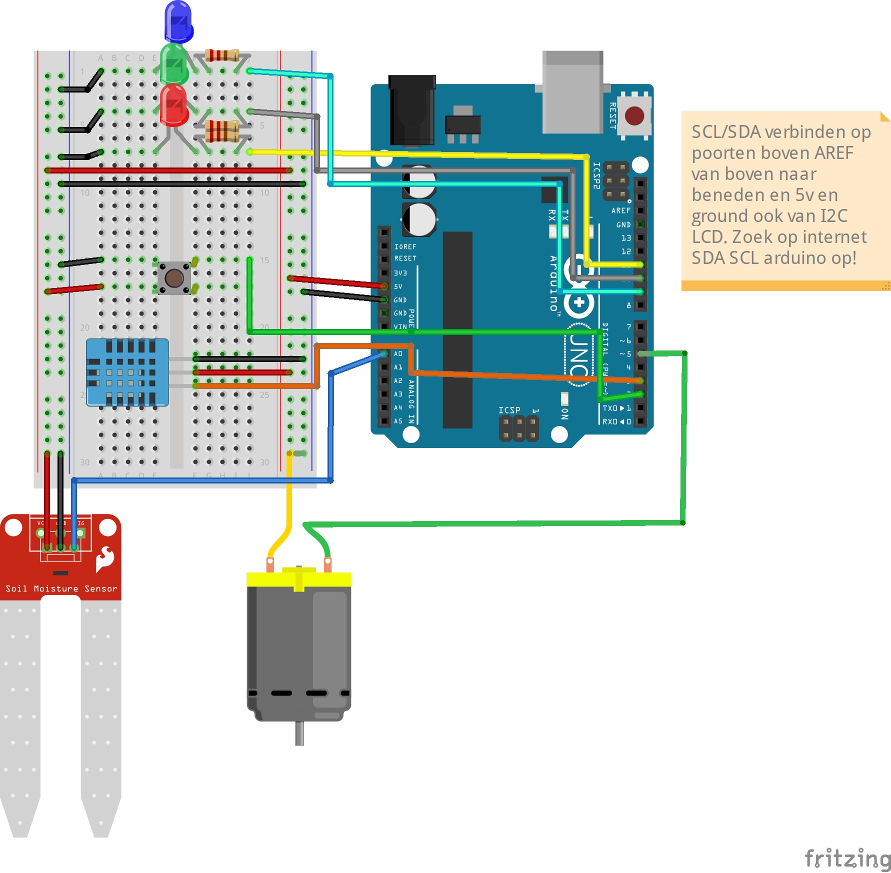

# IMC_IND
plant Room Sensor built with arduino

## About

Made by Dave Visser for the IMC individual assignment.

## Instructions

Please use in arduino IDE. I made use of two libraries, the links to these repo's can be found in the .ino file.

## Schematic

